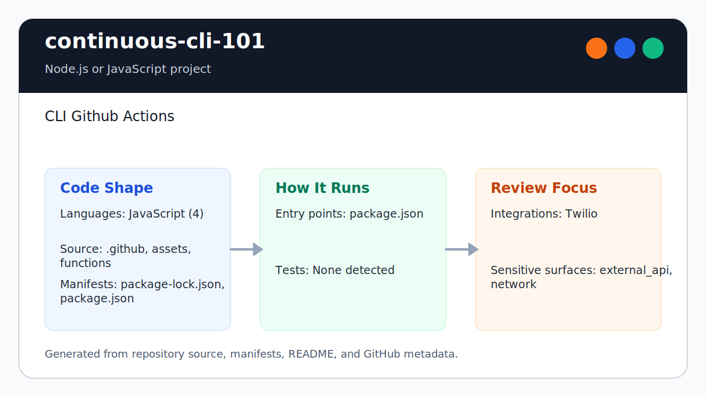

# continuous-cli-101

<!-- README-OVERVIEW-IMAGE -->


## Overview

`garethpaul/continuous-cli-101` is a Twilio Serverless training sample with a
GitHub Actions deployment workflow.

This README is based on the checked-in source, manifests, scripts, and repository metadata on the `main` branch. The project language mix found during review was: JavaScript (4).

## Repository Contents

- `README.md` - project overview and local usage notes
- `package.json` - JavaScript dependency and script metadata
- `.github` - source or example code
- `assets` - source or example code
- `functions` - source or example code
- `package-lock.json` - JavaScript dependency and script metadata
- `SECURITY.md` - security reporting and disclosure guidance
- `VISION.md` - project direction and maintenance guardrails

Additional scan context:

- Source directories: .github, assets, functions
- Dependency and build manifests: package-lock.json, package.json
- Entry points or build surfaces: package.json
- Test harness: `scripts/test-functions.js`

## Getting Started

### Prerequisites

- Git
- Node.js 20, matching `.nvmrc`
- npm

### Setup

```bash
git clone https://github.com/garethpaul/continuous-cli-101.git
cd continuous-cli-101
npm ci
```

The setup commands above are derived from repository files. Legacy mobile, Python, or JavaScript samples may require older SDKs or package versions than a modern workstation uses by default.

## Running or Using the Project

- Run `npm start` for the default development command.

Detected npm scripts:

- `npm run audit` - `npm audit --audit-level=high`
- `npm run check` - `scripts/check-baseline.sh`
- `npm run deploy` - `twilio-run deploy`
- `npm run lint` - `eslint assets functions scripts --max-warnings=0`
- `npm run start` - `twilio-run`
- `npm run test` - `node scripts/test-functions.js`
- `npm run verify` - `npm run lint && npm test && npm run check && npm run audit`

## Testing and Verification

Run the local function harness before changing or deploying functions:

```bash
make check
npm run lint
npm test
npm run check
npm run audit
npm run verify
```

`npm run lint` runs ESLint against the checked-in JavaScript assets,
functions, and test scripts with zero warnings allowed.

The test harness stubs the Twilio Runtime and TwiML response classes, so it
does not require Twilio credentials, network access, or a deployment. It covers
the public JSON function, protected SMS reply, private asset message, and the
missing private asset error path, including a null Runtime asset map and a
malformed private asset export.

`npm run check` runs `scripts/check-baseline.sh` for source-only guardrails.
`npm run verify` runs lint, tests, source checks, and the high-severity npm
audit gate in the same order used by CI.

When the required SDK or runtime is unavailable, use static checks and source review first, then verify on a machine that has the matching platform toolchain.

## Configuration and Secrets

- Twilio account SIDs, API keys, and API secrets must live in GitHub Actions
  secrets or local environment variables only.
- GitHub Actions runs `npm run verify` for pushes and pull requests. Twilio
  deployment is only available through a manual `workflow_dispatch` run.

## Security and Privacy Notes

- Review changes touching external API calls or credential-adjacent configuration; examples from the scan include .github/workflows/main.yml, assets/index.html, functions/private-message.js, functions/sms/reply.protected.js, and 1 more.
- Review changes touching network requests, sockets, or service endpoints; examples from the scan include assets/index.html.

## Maintenance Notes

- See `SECURITY.md` for vulnerability reporting and safe research guidance.
- See `VISION.md` for project direction and contribution guardrails.
- See `CHANGES.md` for maintenance history.
- See `docs/plans/2026-06-08-continuous-cli-check-wrapper.md` for the root
  verification wrapper baseline.

## Contributing

Keep changes small and tied to the project that is already present in this repository. For code changes, document the toolchain used, avoid committing generated dependency directories or local configuration, and update this README when setup or verification steps change.
